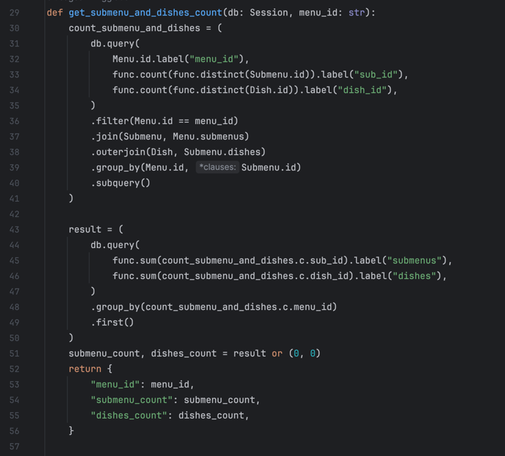

# Y_lab_fastapi

## **Задание 1:**

  
 Описание и установка 

  Написать проект на FastAPI с использованием PostgreSQL в качестве БД. В проекте следует реализовать REST API по работе с меню ресторана, все CRUD операции. Даны 3 сущности: Меню, Подменю, Блюдо.

**Зависимости:**

  - У меню есть подменю, которые к ней привязаны.
    - У подменю есть блюда.

**Условия:**

  - Блюдо не может быть привязано напрямую к меню, минуя подменю.
    - Блюдо не может находиться в 2-х подменю одновременно.
    - Подменю не может находиться в 2-х меню одновременно.
    - Если удалить меню, должны удалиться все подменю и блюда этого меню.
    - Если удалить подменю, должны удалиться все блюда этого подменю.
    - Цены блюд выводить с округлением до 2 знаков после запятой.
    - Во время выдачи списка меню, для каждого меню добавлять кол-во подменю и блюд в этом меню.
    - Во время выдачи списка подменю, для каждого подменю добавлять кол-во блюд в этом подменю.

**УСТАНОВКА:**

1. Поднимаем БД через докер. Для этого в терминале пишем команду

`docker run --name some-postgres -p 5432:5432 -e POSTGRES_PASSWORD=y_lab -d postgres`

3. Копируем проект к себе.

4. Добавляем зависимости. Для этого заходим в проект и терминале прописываем

`pip install -r requirements.txt`

4. Далее запускаем нашу программу

`python main.py`
или
`python3 main.py`

Ждем когда программа запустится и можем тестить.
  

## **Задание 2**

    
 NoSQL, Docker, Тестирование 

В этом домашнем задании надо написать тесты для ранее разработанных ендпоинтов вашего API после Вебинара №1.

Обернуть программные компоненты в контейнеры. Контейнеры должны запускаться по одной команде “docker-compose up -d” или той которая описана вами в readme.md.

Образы для Docker:

    (API) python:3.10-slim
    
    (DB) postgres:15.1-alpine

1. Написать CRUD тесты для ранее разработанного API с помощью библиотеки pytest

2. Подготовить отдельный контейнер для запуска тестов. Команду для запуска указать в README.md

3. \* Реализовать вывод количества подменю и блюд для Меню через один (сложный) ORM запрос.

4. ** Реализовать тестовый сценарий «Проверка кол-ва блюд и подменю в меню» из Postman с помощью pytest

Если FastAPI синхронное - тесты синхронные, Если асинхронное - тесты асинхронные

_*Оборачиваем приложение в докер._

_**CRUD – create/update/retrieve/delete._

# **Запуск приложения и прогон тестов**

Про тесты: всего 4 теста, как в postman'е:

первый тест (test_menu_crud) - тест меню, второй (test_submenu_crud) - тест субменю, третий (test_dishes_crud) - тест блюд, четверты (test_count) - проверка на количество блюд.

* Клонируем проект из Git. Для этого вводим команду

`git clone https://github.com/gglo0ol/Y_lab_fastapi`

* Заходим в папку с проектом.
* \* Для запуска тестов вводим в терминале команду 

`docker compose -f docker-compose-test.yml up -d && docker logs --follow backend && docker compose -f docker-compose-test.yml down -v`

при этом поднимается тестовая БД и логи тестов у нас будут отображаться в терминале  

* Чтобы запустить само приложение с БД

`docker compose up -d`

* Прложение будет доступно по ссылке 

`http://0.0.0.0:8000/docs`

* Чтобы завершить выполнение

`docker compose down -v`

При этом удалятся все временные файлы

### Пункт 3 задания ( Реализовать вывод количества подменю и блюд для Меню через один (сложный) ORM запрос) выполнен в логике модуля menus/crud, а именно в функции get_submenu_and_dishes_count.
#### Так же добавлен "хендлер" для отображения данных для конкретного меню.

